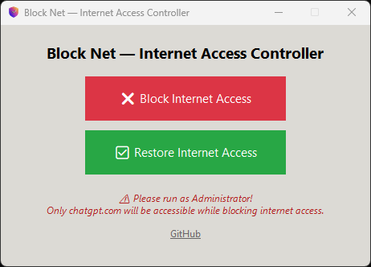

# 🛡️ Block Net — Internet Access Controller

**Block Net** is a lightweight Windows desktop tool that lets you block all internet access **except** for [chatgpt.com](https://chatgpt.com) with just one click. It's ideal for distraction-free work or experimental sandboxing.


## Features

- **Enable ChatGPT-Only Mode** – allows only `chatgpt.com` and DNS through the firewall.
- **Restore Full Internet** – quickly revert all changes and re-enable full access.
- **System Tray Support** – runs quietly in the background with tray access.
- **Administrator Check** – prompts for admin rights when needed.

## Preview



## Admin Permissions

Block Net works by modifying your Windows Firewall rules. This requires administrative privileges. If you don’t run it as administrator, it will show a warning and skip the firewall configuration.

## Development Requirements

### Install Requirements

> Make sure you're using **Python 3.10+** on **Windows**

```bash
pip install pystray pillow
```

###  Packaging as EXE

You can bundle the app into a standalone `.exe` using **PyInstaller**:

```bash
pyinstaller --onefile --windowed --icon=icon.ico --manifest=blocknet.manifest blocknet.py
```

* `--onefile`: bundle into a single executable
* `--windowed`: hide console window
* `--icon`: use your custom `.ico` file
* `--manifest`: add a manifest for requesting admin permissions

You can customize the `blocknet.manifest` to include:

* `requireAdministrator` UAC access
* DPI awareness

## License

Licensed under the [MIT License](LICENSE).
Free for personal and commercial use.
